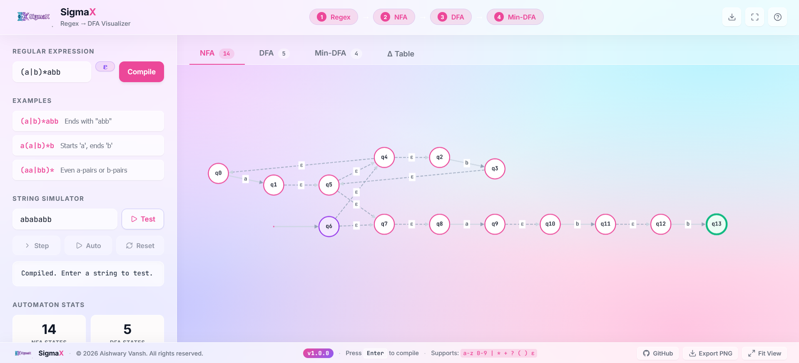
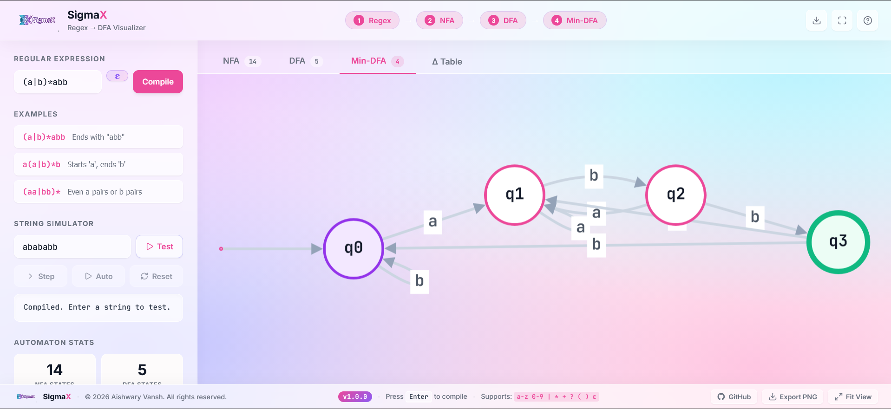
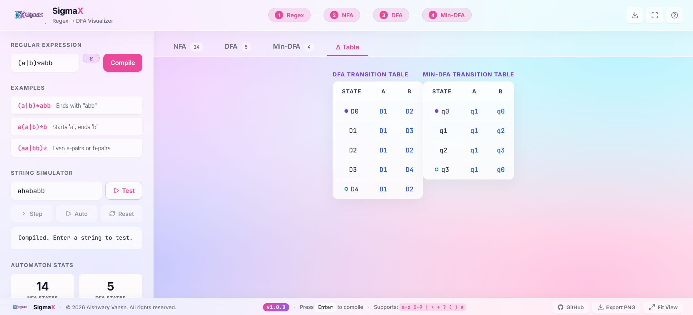

# SigmaX — Regex → DFA Visualizer

> An interactive, browser-based compiler pipeline that transforms a regular expression into a minimized DFA through the full formal-language theory stack — built entirely from scratch with zero algorithmic dependencies.


<!-- <p align="center">
  
</p> -->

---

## Overview

SigmaX is a full-pipeline **regular expression compiler visualizer**. It implements the classical theory-of-computation transformation chain end-to-end:

```
Regex  →  NFA  (Thompson's Construction)
NFA    →  DFA  (Subset Construction / Powerset)
DFA    →  Min-DFA  (Hopcroft's Algorithm)
```

Every algorithm is implemented **from scratch in pure JavaScript** — no parser-combinator libraries, no automata toolkits. The system supports live string simulation on the minimized DFA with step-by-step execution tracing, and exports publication-quality automaton graphs as PNG.

---

## Live Demo

[](https://regex-dfa-visualizer.vercel.app/)

---

## Screenshots

| NFA View | Min-DFA Simulation | Transition Table |
|---|---|---|
|  |  |  |

---

## Features

- **Full compiler pipeline** — Regex → NFA → DFA → Min-DFA, rendered as interactive directed graphs
- **Zero-dependency engine** — Thompson's Construction, Subset Construction, and Hopcroft's Minimization written from scratch
- **ε (epsilon) support** — First-class epsilon literal in regex syntax; correctly excluded from the alphabet Σ and handled as a transparent ε-transition in NFA construction
- **Step-by-step DFA simulator** — Animate string acceptance/rejection one character at a time with a visual input tape
- **Execution trace log** — Timestamped δ-transition trace for every simulation step
- **Transition tables** — Formatted δ-table for both DFA and Min-DFA states
- **Parallel-edge layout** — Multi-symbol edges between the same state pair are merged; parallel bezier curves are offset automatically
- **Robust PNG export** — Export any automaton view at 2.5× resolution (uses `Blob` object URLs to safely bypass browser limits for massive base64 graphs)
- **Glassmorphism UI** — Premium frosted-glass design with animated graph transitions (Dagre layout, 350ms ease)

---

## Technical Architecture

### Engine (`src/core/RegexEngine.js`)

The core is a **single-pass, scratch-built regex compiler** with four stages:

#### Stage 1 — Explicit Concatenation Insertion
Inserts a synthetic `.` operator between implicitly concatenated tokens (e.g. `ab` → `a.b`). Handles the full Unicode code-point stream so multi-byte characters like `ε` are treated atomically.

#### Stage 2 — Shunting-Yard (Infix → Postfix)
Converts the infix regex to postfix (Reverse Polish Notation) using Dijkstra's Shunting-Yard algorithm with a custom precedence table:

| Operator | Precedence |
|---|---|
| `\|` (union) | 1 |
| `.` (concat) | 2 |
| `?`, `*`, `+` | 3 |

#### Stage 3 — Thompson's NFA Construction
Builds an NFA from postfix using a fragment stack. Each operator pops fragments and rewires ε-transitions:

- **Literal / ε** → 2-state fragment with one labeled transition
- **Concatenation** → ε-chain two fragments
- **Union `|`** → new start/accept states with ε-branches to both fragments
- **Kleene `*`** → skip arc + loop back arc via ε
- **`+`** → loop back arc via ε, no skip arc
- **`?`** → skip arc via ε, no loop

#### Stage 4 — Subset Construction (NFA → DFA)
Standard powerset construction. Each DFA state is an **ε-closure** of a set of NFA states. States are keyed by sorted, comma-joined NFA state ID sets for deterministic, cache-friendly identity.

#### Stage 5 — Hopcroft's Minimization (DFA → Min-DFA)
Partition-refinement algorithm with the standard optimisation of initially adding the **smaller** of {accept, reject} to the worklist. Groups are assigned deterministic IDs (`q0`, `q1`, …) by BFS insertion order so the start state is always `q0`.

### Validator (`validateRegex`)
A single-pass O(n) validator that catches: unmatched parentheses, leading operators, trailing `|`, and empty alternation branches — before the engine is invoked.

### Graph Renderer (`src/components/CytoscapeGraph.jsx`)
- **Cytoscape.js** with the **Dagre** layout engine (left-to-right rank direction)
- Animated layout transitions (350ms)
- Parallel-edge deduplication: edges between the same `(source, target)` pair are merged into a single bezier with a combined label (e.g. `a,b`)
- Simulation highlighting via CSS class injection (`hl`, `visited`, `dead`) driven by React state

---

## Algorithms — Complexity

| Algorithm | Time | Space |
|---|---|---|
| Thompson's Construction | O(n) | O(n) |
| Subset Construction | O(2^n · \|Σ\|) worst-case | O(2^n) |
| Hopcroft's Minimization | O(n · \|Σ\| · log n) | O(n) |

Where `n` = number of NFA states, `|Σ|` = alphabet size.

---

## Tech Stack

| Layer | Technology |
|---|---|
| Framework | React 19 + Vite 8 |
| Graph Rendering | Cytoscape.js 3.33 + cytoscape-dagre |
| Icons | Lucide React |
| Styling | Vanilla CSS (CSS custom properties, glassmorphism) |
| Typography | Inter (UI) + JetBrains Mono (code/states) |
| Build | Vite (ESM, HMR) |

**No UI component libraries. No CSS frameworks. No automata libraries.**

---

## Getting Started

### Prerequisites
- Node.js ≥ 18
- npm ≥ 9

### Installation

```bash
git clone https://github.com/aishwary-vansh/Regex-to-DFA.git
cd Regex-to-DFA
npm install
```

### Development

```bash
npm run dev
# → http://localhost:5173
```

### Production Build

```bash
npm run build
npm run preview
```

---

## Supported Regex Syntax

| Syntax | Meaning | Example |
|---|---|---|
| `a` – `z`, `0` – `9` | Literal character | `a`, `0` |
| `\|` | Union (alternation) | `a\|b` |
| `*` | Kleene star (zero or more) | `a*` |
| `+` | One or more | `a+` |
| `?` | Zero or one (optional) | `a?` |
| `( )` | Grouping | `(ab)+` |
| `ε` | Epsilon — empty string literal | `a\|ε` |

---

## Project Structure

```
sigmax/
├── index.html
├── vite.config.js
├── package.json
└── src/
    ├── main.jsx              # React entry point
    ├── App.jsx               # Root component, simulation state machine
    ├── index.css             # Design system (tokens, components, layout)
    ├── core/
    │   └── RegexEngine.js    # Full compiler pipeline (pure JS, no deps)
    └── components/
        └── CytoscapeGraph.jsx # Graph renderer + simulation highlighter
```


---

## Key Design Decisions

**Why scratch-built?**  
Using an existing regex-to-automaton library would defeat the purpose. Every algorithm is implemented to spec so the visualization accurately reflects the theory.

**Why Cytoscape.js over D3?**  
Cytoscape is purpose-built for graph topology with built-in layout algorithms (Dagre for ranked DAGs) and a clean imperative API that integrates well with React's unidirectional data flow via `useRef`.

**Why Hopcroft over table-filling?**  
Hopcroft's `O(n log n)` is asymptotically superior to the `O(n²)` table-filling algorithm and produces a canonical minimal DFA under the same partition constraints.

**Why `[...str]` instead of `str[i]` in the engine?**  
JavaScript strings are UTF-16. Multi-byte Unicode characters like `ε` (U+03B5) must be iterated as code points, not code units, to avoid corrupting the token stream.

---

## License

MIT © 2026 Aishwary Vansh
